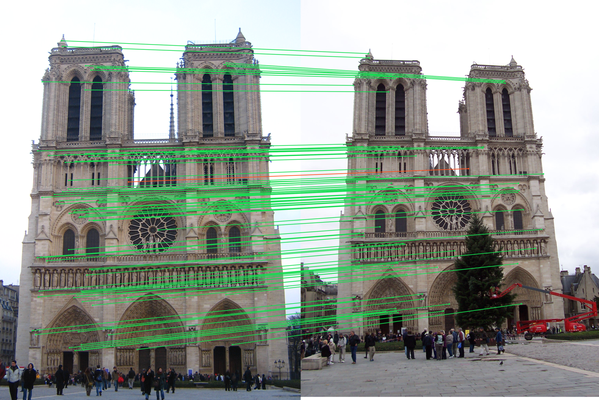
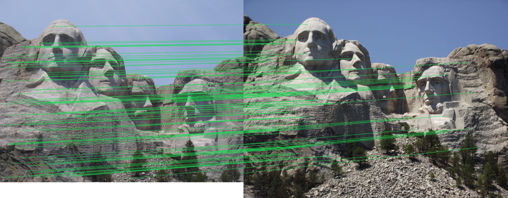
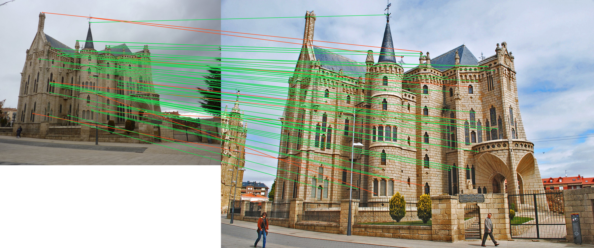

# Local Feature Matching with PCA-Reduced SIFT

A computer-vision project for matching local features across different views of real-world landmarks. The notebook detects SIFT keypoints, reduces the 128-dimensional descriptors to 32 dimensions with PCA, applies the nearest-neighbor distance-ratio test, and evaluates the accepted correspondences against supplied ground-truth data.



## Project Overview

The notebook implements the complete workflow for:

- Loading three landmark image pairs and their evaluation files.
- Detecting SIFT keypoints and extracting local descriptors.
- Supporting optional BRISK detection and description.
- Fitting PCA jointly across both descriptor sets.
- Reducing descriptors from 128 dimensions to 32 dimensions.
- Computing nearest-neighbor descriptor distances in chunks.
- Applying the nearest-neighbor distance-ratio test.
- Ranking accepted matches by confidence.
- Evaluating matches against supplied ground-truth correspondences.
- Saving correspondence visualizations and quantitative metrics.

SIFT and BRISK detection are provided by OpenCV. The notebook implements the surrounding PCA reduction, matching, evaluation, and visualization workflow.

## Results

| Image pair | Accepted matches | Top 50 accuracy | Top 100 accuracy | All matches |
|---|---:|---:|---:|---:|
| Notre Dame | 595 | 98% | 99% | 91% |
| Mount Rushmore | 406 | 100% | 100% | 99% |
| Episcopal Gaudi | 69 | 86% | — | 86% |

The 32-dimensional PCA descriptors retained approximately 78–80% of the original descriptor variance.

### Mount Rushmore



### Episcopal Gaudi



## Repository Structure

```text
.
├── data/
│   ├── EpiscopalGaudi/
│   ├── MountRushmore/
│   ├── NotreDame/
│   └── README.md
├── notebook/
│   └── local-feature-matching-with-pca-reduced-sift.ipynb
├── results/
│   ├── episcopal-gaudi-matches.png
│   ├── metrics.json
│   ├── mount-rushmore-matches.png
│   └── notre-dame-matches.png
├── .gitignore
├── requirements.txt
└── README.md
```

The notebook is the canonical implementation. There are no separate source modules or standalone experiment scripts.

## Run the Notebook Locally

Create and activate a virtual environment, then install the dependencies:

```bash
python -m venv .venv
source .venv/bin/activate
pip install -r requirements.txt
jupyter notebook
```

Open:

```text
notebook/local-feature-matching-with-pca-reduced-sift.ipynb
```

The repository notebook may be adjusted to use the local `data/` directory when running outside Kaggle.

## Run on Kaggle

The Kaggle version uses the shared **Computer Vision Assets** dataset and locates:

```text
local-feature-matching-with-pca-reduced-sift/
├── EpiscopalGaudi/
├── MountRushmore/
└── NotreDame/
```

Generated files are written to:

```text
/kaggle/working/outputs
```

Add the public Kaggle notebook URL here after publishing it.

## Dependencies

- Python
- OpenCV
- NumPy
- pandas
- Pillow
- SciPy
- scikit-image
- scikit-learn
- Jupyter Notebook

## Course Context

Developed for the Computer Vision course at the University of Science and Technology, Zewail City, during Spring 2023.
